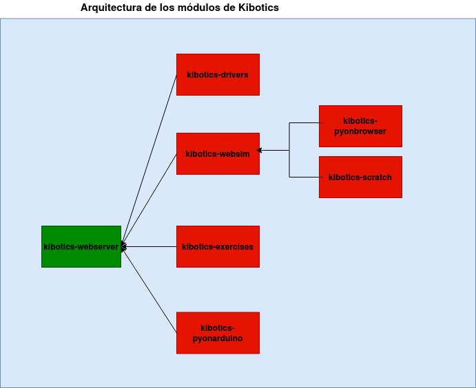
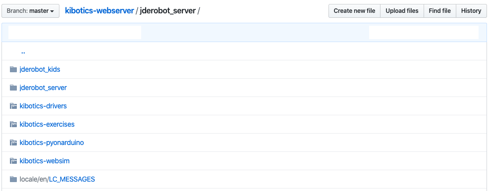
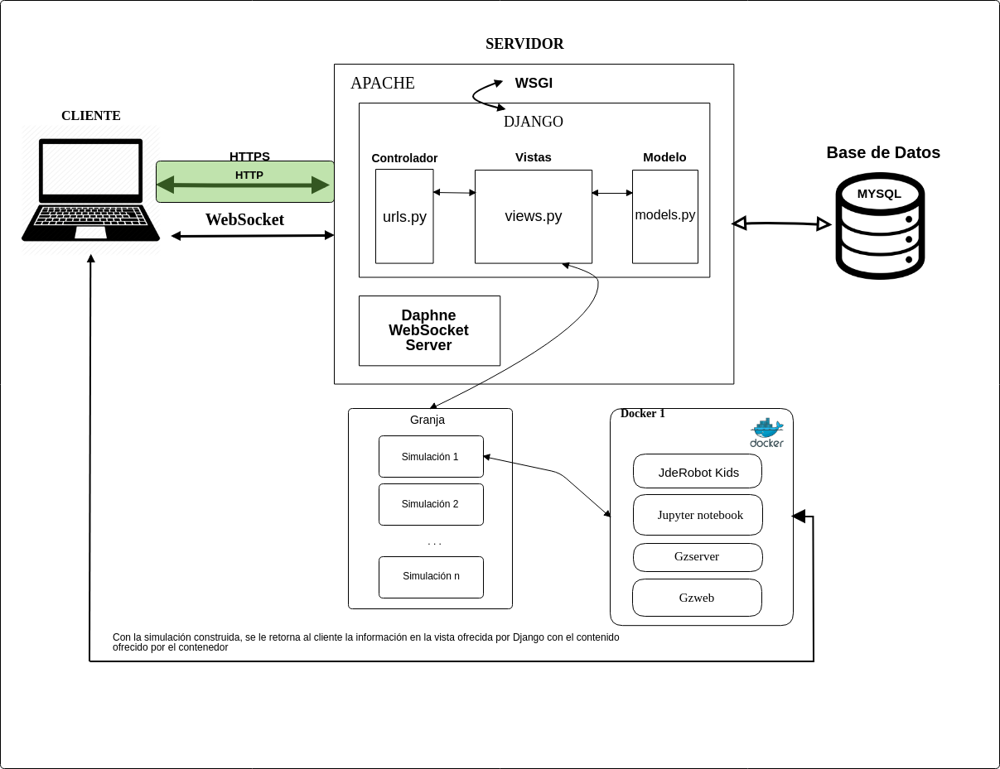
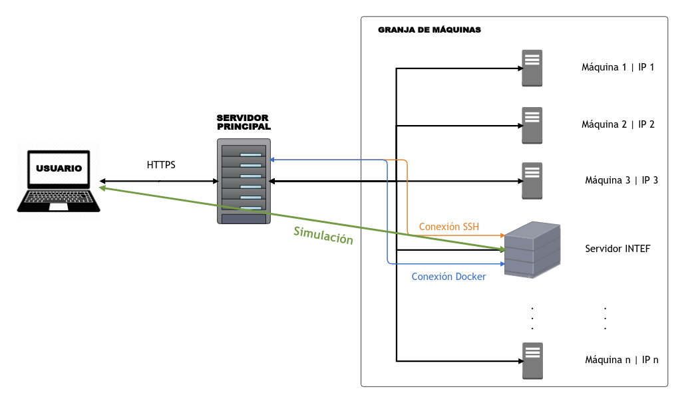
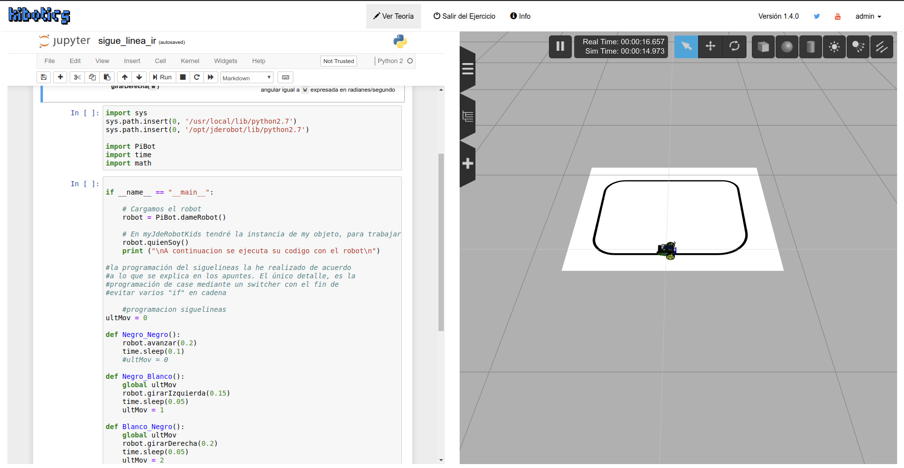
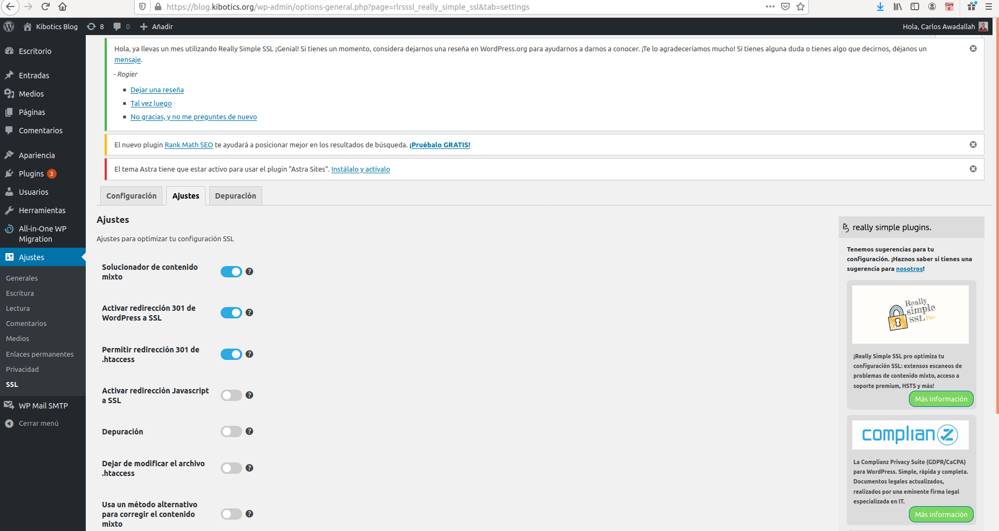
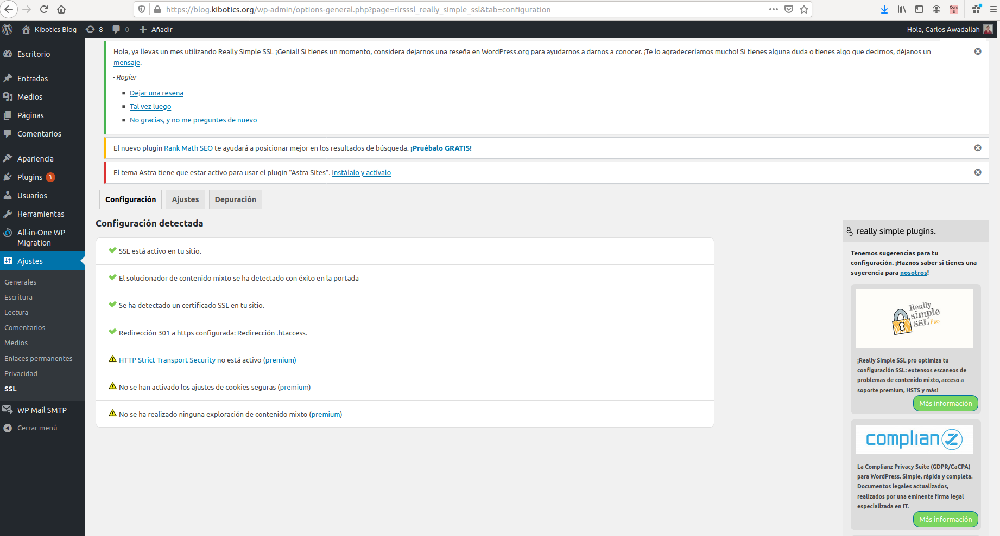
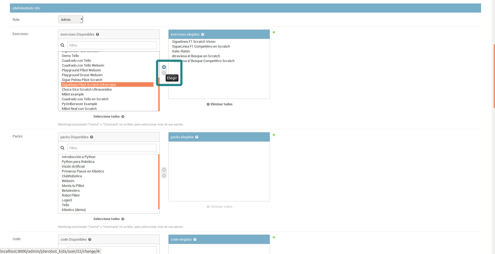
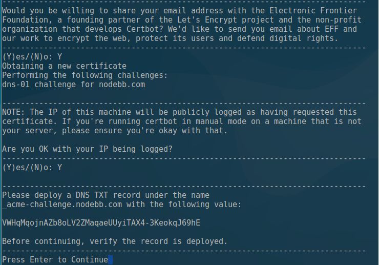
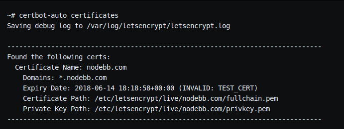

# Kibotics


* [0. Esquema general de la plataforma.](#0-esquema-general)
* [1. Instalación de Kibotics.](#1-instalacion-kibotics)
    + [1.1.  Módulos necesarios para la aplicación.](#1.1-modulos-necesarios-aplicacion)
    + [1.2. Paquetes necesarios de Linux.](#1.2.paquetes-necesarios-linux)
+ [2. Instalación para desarrollador.](#2.instalacion-desarrollador)
  + [2.1. MySQL en Docker](#2.1.instalacion-mysql-docker).
  + [2.2. Instalación de MySQL y creación de base de datos](#2.2.instalacion-mysql-creacion-base-datos).
  + [2.3. Instalación de dependencias](2.3.instalacion-dependencias)
  + [2.4. Creación y activación del entorno virtual](#2.4-creacion-activacion-entorno-virtual)
  + [2.5. Instalación de paquetes pip](#2.5.instalacion-paquetes-pip)
* [3. Makers. Discourse para el foro.](#3-makers-discourse-foro)
    + [3.1. Instrucciones para levantar el foro *Makers*.](#3.1-instrucciones-levantar-foro)
      - [3.1.1. Parte docker.](#3.1.1-parte-docker)
      - [3.1.2. Configurar interfaz de red.](#3.1.2-configurar-interfaz-red)
      - [3.1.3. Configurar Apache.](#3.1.3-configurar-apache)
* [4. Blog de Kibotics con wordpress](#4-wordpress-blog)
    + [4.1. Instrucciones para levantar el Blog con *Wordpress*.](#4.1-instrucciones-levantar-blog)
      - [4.1.1. Parte docker.](#4.1.1-parte-docker)
      - [4.1.2. Configurar interfaz de red.](#4.1.2-configurar-interfaz-red)
      - [4.1.3. Configurar capa SSL.](#4.1.3-configurar-ssl)
* [5. WebSim.](#5-websim)
* [6. Gestión de la aplicación.](#6-gestion-aplicacion)
    + [6.1. Arrancar la aplicación (modo desarrollo).](#6.1-arrancar-aplicacion)
    + [6.2. Desarrollo Local del Servidor Web de Kibotics.](#6.2-desarrollo-local)
    + [6.3. Carpeta ejercicios (repositorio *exercises*).](#6.3-carpeta-ejercicios)
* [7. Apache - Configuración.](#7-apache-configuracion)
    + [7.1. Módulos necesarios.](#7.1-modulos-necesarios)
    + [7.2. Habilitar módulos.](#7.2-habilitar-modulos)
    + [7.3. Seguridad en Apache (SSL).](#7.3-seguridad-apache)
    + [7.5. Certificados comodín (WildCard).](#7.5-certificados-comodin)
      - [7.5.1. Renovar certificados WildCard.](#7.5.1-renovar-certificados)
    + [7.6. Servidores de WebSockets en producción.](#7.6-servidores-websockets-produccion)
    + [7.7. Usuario Apache y permisos](#7.7-usuario-apache-permisos)
    + [7.8. Backups](#7.8-backups)
    + [7.9. Monitorización](#7.9-monitorizacion)
    + [7.10. Integración en Producción de cambios en el código fuente.](#7.10-integracion-produccion)
* [8. Servicios.](#8-servicios)
    + [8.1 Instalación de Servicios](#8.1-instalar-servicios)
    + [8.2 Activar servicios](#8.2-activar-servicios)
    + [8.3 Gestión de servicios](#8.3-gestion-servicios)
    + [8.4 Gestión de Tareas](#8.4-gestion-tareas)
    + [8.5 Ofuscación](#8.5-ofuscacion)
* [9. Testing](#9-testing)
    + [9.1 Primer Test](#9.1-primer-test)
* [10. Logs](#10-logs)
* [11. FAQ](#11-faq)
* [Referencias](#referencias)

<a name="0-esquema-general"></a>
## 0. Esquema general de la aplicación
Diagrama de conexión entre los diferentes módulos (aplicaciones independientes) que componen la aplicación.


Para replicar la infraestructura es necesario **clonar cada uno de los módulos (repositorios) de la figura dentro de jderobot_server/**.

Desde la raíz del proyecto:

```
    cd jderobot_server/
    git clone https://github.com/jderobot-hub/kibotics-drivers
    git clone https://github.com/jderobot-hub/kibotics-websim
    git clone https://github.com/jderobot-hub/kibotics-exercises
    git clone https://github.com/jderobot-hub/kibotics-pyonarduino
```

**Importante**, asegurate de que todos los repositorios (módulos) complementarios están en la rama master en el último commit disponible.
La configuración debería ser la siguiente, con los submódulos en **jderbot_server/**:



El siguiente infograma muestra el conexionado de todos los agentes involucrados en la infraestructura de Kibotics.


En este documento se realiza una aproximación al esquema de estructura de la aplicación web de Kibotics. La explicación de los siguientes puntos se realiza sobre la imagen que se muestra a continuación:



Podemos distinguir **3 partes**:

- Usuario.
- Servidor principal.
- Granja de máquinas.

Cuando un usuario **accede** a la plataforma lo hace a través del protocolo HTTPS hacia el **servidor principal** (en el centro del diagrama). Este servidor es el **orquestador de eventos** que tienen lugar en el resto de máquinas de la granja de máquinas (parte derecha del diagrama).

#### Simulación

El **núcleo principal** de la aplicación se materializa en lo que denominamos "**simulación**". Una simulación está compuesta principalmente de **dos partes**: el **código** que programa el estudiante (izquierda) y la **ventana de simulación** (derecha) como puede verse en la siguiente figura.




<a name="1-instalacion-kibotics"></a>
## 1. Instalación de Kibotics.


<a name="1.1-modulos-necesarios-aplicacion"></a>
### 1.1.  Módulos necesarios para la aplicación.

| Módulo   | Versión        | Instalación                   | Observaciones                                                |
| -------- | -------------- | ----------------------------- | ------------------------------------------------------------ |
| Django   | `1.11`         | `pip install django==1.11`    | Versiones válidas entre la 1.9 y 1.11.                       |
| JSON     | `3.17.0`       | `pip install simplejson==3.17.0` | Gestión de los JSON.                                         |
| Channels | `1.1.5`        | `pip install channels==1.1.5` | Conexiones WebSockets (incluye `daphne==1.4.2` y `asgi-redis==1.2.0`). |
| PyGitHub | `1.43.2`       | `pip install pygithub`        | Gestión de los ficheros de los usuarios con GitHub.          |
| Django Extensions | `2.2.5` | `pip install django-extensions==2.2.5` | Extensiones del _Framework_ Django.               |
| MySQL Client | `1.3.14`   | `pip install mysqlclient==1.3.14` | Interfaz de Python para acceder a una base de datos MySQL  |
| Redis    | `1.4.3`        | `pip install asgi-redis==1.4.3` | Capa de ASGI channels a través de Redis.          |
| Paramiko | `2.7.0`       | `pip install paramiko==2.7.0`  | Implementación para Python 2.7 de un cliente y servidor SSH. |
| Queryset CSV | `1.0.3`       | `pip install django-queryset-csv==1.0.3` | Exportador en formato CSV de _querysets_ de Django. |
| Requests | `2.22.0`       | `pip install requests==2.22.0` | Gestión de peticiones HTTP desde Python.          |
| PyDiscourse | `0.9.0`       | `pip install pydiscourse==0.9.0` | Manejo del _software_ de Discourse desde Python. |
| Taggit Autosuggest | `0.3.8`       | `pip install django-taggit-autosuggest==0.3.8` | Modelo de Etiqueta de Django (incluye `django-taggit`). |
| Pillow | `6.2.2`       | `pip install pillow==6.2.2` | Librería de Imagen de Python. |
| django_elasticsearch_dsl | `7.1.1`       | `pip install django_elasticsearch_dsl==7.1.1` | Módulo conexión con ElasticSearch. |
| user-agents | `2.1`       | `pip install user-agents==2.1` | Facilita el análisis de las peticiones HTTP para sacar info. del dispositivo. |
| django-online-users | `0.3`       | `pip install django-online-users==0.3` | Librería para conocer los usuarios online. |
| matplotlib | `3.1.2`       | `pip install matplotlib==3.1.2` | Libreria para la generación de gráficos. |
| numpy | `1.17.4`       | `pip install numpy==1.17.4` | Libreria de soporte para vectores y matrices. |
| python-geoip-python3 | `1.3`       | `pip install python-geoip-python3==1.3` | Libreria de acceso a información geográfica por IP. |
| python-geoip-geolite2 | `2015.303`       | `pip install python-geoip-geolite2==2015.303` | Libreria de soporte geoip. |

La aplicación actualimente utiliza Python3.6. Los módulos necesarios para la aplicación se encuentran en `requirements.txt`.
 Para instalar todos los paquetes a la vez, como se muestra en [2.5](#2.5.instalacion-paquetes-pip), ejecutar:
 ```
    pip3 install -r requirements.txt
 ```

<a name="1.2.paquetes-necesarios-linux"></a>
### 1.2 Paquetes necesarios de Linux.

| Paquete                 | Instalación                      |
| ----------------------- | -------------------------------- |
| redis-server            | `apt install redis-server`       |

Instalación de basemap para uso en Elasticsearch:
```
    sudo apt-get install libgeos-dev
    pip install --user https://github.com/matplotlib/basemap/archive/master.zip
```


<a name="2.instalacion-desarrollador"></a>

## 2. Instalación para desarrollador

La siguiente sección está orientada a replicar en local el entorno completo de la aplicación Kibotics para desarrollo.

<a name="2.1.instalacion-mysql-docker"></a>

### 2.1.- MySQL en Docker

Para evitar toda la instalación y configuración de MySQL en el entorno local, puede crearse el servidor de base de datos utilizando un contenedor Docker. (El servidor de `redis` sigue siendo necesario, o bien vía otro contenedor o su instalación en local).

Como primer paso será la [instalación del entorno docker siguiendo su documentación](https://docs.docker.com/install/linux/docker-ce/ubuntu/#install-using-the-repository). Una vez ejecutado el contenedor de prueba: `docker run hello-world` puede instalarse el contenedor de MySQL:

```bash
docker pull mysql
```

Arrancamos el contenedor de MySQL con:

```bash
docker run --name kibotics_db -e MYSQL_ROOT_PASSWORD=robotica2018  -e MYSQL_USER=kidsapp -e MYSQL_PASSWORD=robotica2018 -e MYSQL_DATABASE=kibotics mysql
```

Fíjate como en el arranque del contenedor tenemos:

- Nombre del contenedor = `kibotics_db`. Una vez terminemos el desarrollo un día y apaguemos la máquina (o apaguemos el contenedor con: `docker stop kibotics_db`), una nueva sesión habrá que hacer simplemente: `docker start kibotics_db`.

- Variables de entorno (de configuración de Django). Los valores de estas variables están en el fichhero `jderobot_server/jderobot_server/settings.py` del proyecto (sección base de datos).

La primera vez que configuramos el contenedor, tendremos que pasarle la base de datos de prueba que se encuentra en la raíz del proyecto con el siguiente comando:

```bash
docker exec -i kibotics_db mysql -uroot -probotica2018 kibotics < kibotics_dummy.sql
```

Ya solo queda ir al fichero `jderobot_server/jderobot_server/settings.py` y cambiar la IP por la que lanza docker. Por defecto: `172.17.0.2`. Puedes ver la IP de docker con: `docker inspect kibotics_db`.

```bash
. . .
DATABASES = {
    'default': {
        'ENGINE': 'django.db.backends.mysql',
        'NAME': "kibotics",
        'USER': "kidsapp",
        'PASSWORD': "robotica2018",
        'HOST' : "172.17.0.2",
        'PORT': "3306",
    }
}
. . .
```

*Nota: se tiene que tener el flag `DEBUG=True`*

Como se dijo antes. Terminar una sesión, parará el contenedor. Para volver a arrancarlo, simplemente: `docker start kibotics_db`.

<a name="2.2.instalacion-mysql-creacion-base-datos"></a>

### 2.2.- Instalación de MySQL y creación de la base de datos (Ubuntu 18.04 local).

Instalación del servidor de MySQL, _backend_ para el manejo de la Base de Datos:

```bash
sudo apt install mysql-server
sudo apt-get install -y python3-mysqldb
```

**Nota**: Para versión de Ubuntu 16.04, la consola pedirá que introduzcas la contraseña root. (Opcionalmente) puede lanzarse el instalador (recomendado para Ubuntu 16): `sudo mysql_secure_installation`.

Para Ubuntu 18.04 seguir los siguientes pasos. Si no ha solicitado el programa ingresar la contraseña para el usuario `root` seguir los siguientes pasos para entrar y establecer una que puedas recordar.

```bash
sudo mysqld_safe --skip-grant-tables&
sudo mysql --user=root mysql
```
En la consola de MySQL:
```bash
mysql> update user set authentication_string=PASSWORD('new-password') where user='root';
mysql> flush privileges;
mysql> quit
```

Reiniciamos el servicio y volvemos a entrar a la consola de MySQL:
```bash
sudo service mysql restart
sudo mysql -u root -p
```

1. Entrar a la consola de MySQL (si deniega el acceso, acceder con `sudo` delante del comando):

    ```bash
    mysql -uroot -p
    ```

2.  **Crear la base de datos** (con nombre `kibotics`):

    ```bash
    mysql> CREATE DATABASE kibotics;
    ```

3. Crear un usuario en la base de datos  (por defecto `kidsapp`, la contraseña se encuentra en el fichero de configuración de Django: [settings.py](https://github.com/jderobot-hub/kibotics-webserver/blob/master/jderobot_server/jderobot_server/settings.py), en la variable _DATABASES_):

    ```bash
    mysql> CREATE USER 'kidsapp'@'localhost' IDENTIFIED BY '<pass>';
    ```

    Conceder privilegios al nuevo usuario:

    ```bash
    GRANT ALL PRIVILEGES ON *.* TO 'kidsapp'@'localhost';
    ```

    Refrescar privilegios:

    ```bash
    FLUSH PRIVILEGES;
    ```

4. **Importar la base de datos** (fuera de la consola de MySQL). El proyecto tiene adjunta una base de datos rellena con datos de ejemplo para que se pueda desarrollar directamente llamada kibotics_dummy.sql. Esta base de datos cuenta con los siguientes usuarios, con diferentes permisos. El usuario *admin_dummy* tiene privilegios de admin y puede acceder a todo (parte administrativa inclusive), por lo que se puede utilizar este para incluir nuevos usuarios, permisos, ejercicios...

| User   | Role       | Password                  |
| -------- | -------------- | ----------------------------- |
| admin_dummy   | Admin        | kibotics123456    |
| betatester_dummy   | Betatester        | kibotics123456    |
| teacher_dummy| Profesor        | kibotics123456    |
| student_dummy   | Alumno        | kibotics123456    |
| dummy_user_1   |         | kibotics123456    |
| dummy_user_2   |         | kibotics123456    |
| dummy_user_3   |         | kibotics123456    |
| dummy_user_4   |         | kibotics123456    |
| dummy_user_5   |         | kibotics123456    |
| dummy_user_6   |         | kibotics123456    |
| dummy_user_7   |         | kibotics123456    |
| dummy_user_8   |         | kibotics123456    |
| dummy_user_9   |         | kibotics123456    |


Ejecutar:

    ```bash
    sudo mysql -uroot -p kibotics < kibotics_dummy.sql
    ```

#### 2.2.1. Acceso remoto a la base de datos.

Es posible que en un momento dado resulte interesante el acceso a la BBDD desde otra máquina (fuera del entorno de Kibotics). Autorizar acceso a una máquina externa:

* Entrar en la BBDD con usuario `root`.

```bash
GRANT ALL ON *.* TO remoteUser@'remoteIpadress' IDENTIFIED BY 'my_password';
```

* Cambiar `bind-addess` to `0.0.0.0` en el fichero `/etc/mysql/mysql.conf.d/mysqld.cnf`.

* Reiniciar el servicio:

```bash
sudo service mysql restart
```

<a name="2.3.instalacion-dependencias"></a>

### 2.3.- Instalación de dependencias.

Es posible que se tenga que instalar las siguientes dependencias que complementan los paquetes `pip`:

```bash
sudo apt install libmysqlclient-dev    #<-- Dependencia MySQL.
sudo apt install redis-server          #<-- Daphne.
sudo apt install python3-dev            #<-- Paquete de desarrollador de Python.
```

<a name="2.4-creacion-activacion-entorno-virtual"></a>

### 2.4.- Creación y activación del entorno virtual [OPCIONAL]

Instalar virtual env:

```
    sudo apt install virtualenv
```
- Crear el directorio donde se alojará el entorno virtual:

```
    virtualenv -p /usr/bin/python3.6 kibotics-env
```

Una vez creado, podemos activarlo para hacer las instalaciones que procedan y trabajar dentro de él:

```
    source kibotics-env/bin/activate
```

Ahora podemos trabajar con ese entorno virtual, instalando paquetes o ejecutando la aplicación, por ejemplo.
Una vez se termina de trabajar conn el entorno virtual, see puede desactivar:

```
    deactivate
```

<a name="2.5.instalacion-paquetes-pip"></a>

### 2.5.-Instalación de paquetes pip

El fichero que contiene las dependencias se encuentra en el directorio `docs`. Para instalarlas, introducir:

Asegurate de que tu instalación por defecto de Pip corre sobre Python 3.6 (`pip -V` o `python -V`). Luejo, ejectua:
```bash
pip install -r requirements.txt
```


<a name="3-makers-discourse-foro"></a>

## 3. Makers. Discourse para el foro.

[¿Qué es Discourse?](https://www.discourse.org/about). Es usado para la creación del foro de la plataforma como un servicio independiente **utilizando Docker**, que lo aisla del sistema operativo.

<a name="3.1-instrucciones-levantar-foro"></a>

### 3.1. Instrucciones para levantar el foro *Makers*.

<a name="3.1.1-parte-docker"></a>

#### 3.1.1. Parte docker.

El contenedor del foro makers.kibotics.org (193.147.79.195) está alojado en postre.gsyc.urjc.es (193.147.79.196). El contenedor se llama *app*, si existe (comprobar con `docker ps`) levantarlo de forma habitual:

```bash
docker start app
```

Si no existe o la ejecución del comando anterior genera un error, reconstruirlo con:

```bash
cd /var/discourse
sudo ./launcher rebuild app
```
Esperar a que el comando de reconstrucción devuelva el control del terminal (puede tardar unos minutos). Una vez hecho eso, comprobar si el docker ha podido configurarse correctamente accediendo a la web del foro (i.e: https://makers.kibotics.org/). Si no está accesible, se ha de levantar la interfaz de red de ese contenedor. Levantar dicha interfaz con:

```bash
sudo ifup enp3s0:0
```

Y lanzar el contenedor con:

```bash
docker start app
```

<a name="3.1.2-configurar-interfaz-red"></a>

#### 3.1.2. Configurar interfaz de red.

Hemos asignado una IP específica para el foro, para no tener que tratar con Apache y la redirección de puertos. Para levantar una interfaz en la misma máquina con una IP diferente a la de la propia máquina, se ha modificado ```/etc/network/interfaces``` añadiendo las siguientes lineas

```
iface enp3s0:0 inet static
    address 193.147.79.195/32
```

Nótese que la interfaz de red de esa máquina es ```enp3s0``` por lo que para añadir una nueva interfaz le asignaremos ```enp3s0:0```

Una vez hecho eso, como se especificó anteriormente se levanta dicha interfaz con ```sudo ifup enp3s0:0```

<a name="3.1.3-configurar-apache"></a>

#### 3.1.3. Configurar Apache.
Por defecto Apache escucha en todas las direcciones IP de la máquina, por lo que al intentar levantar el foro makers este se queja por que la direccion IP que se le ha asignado está en uso. Para evitar esto es necesario decirle a Apache que escuche sólo en unas IP/puertos específicos modificando ```/etc/apache2/ports.conf``` con lo siguiente:

```bash
# If you just change the port or add more ports here, you will likely also
# have to change the VirtualHost statement in
# /etc/apache2/sites-enabled/000-default.conf

Listen 193.147.79.196:80   <------------ especificar IP que va a tratar apache (postre.gsyc.urjc.es)
#Listen 8080
#Listen 8888
#Listen 7681

<IfModule ssl_module>
        Listen 193.147.79.196:443    <----- aquí también
</IfModule>

<IfModule mod_gnutls.c>
        Listen 193.147.79.196:443    <------ aquí también
</IfModule>
```

**NOTA**: para dejarlo por defecto eliminar la IP y dejar solo los puertos 80 y 443.*

<a name="4-wordpress-blog"></a>

## 4. Blog de Kibotics con wordpress.
Wordpress es un sistema de gestión de contenidos web que se utiliza para el Blog de Kibotics. De manera similar al foro, su diseño se basa en un servicio independiente **utilizando Docker**, que lo aisla del sistema operativo.

<a name="4.1-instrucciones-levantar-blog"></a>

### 4.1. Instrucciones para levantar el blog con *Wordpress*.

<a name="4.1.1-parte-docker"></a>

#### 4.1.1. Parte docker.

El contenedor del blog blog.kibotics.org (193.147.79.188) está alojado en postre.gsyc.urjc.es (193.147.79.196). El servicio se compone de dos contenedores docker interconectados a través de la herramienta _docker-compose_, con nombres **wordpress** y **wp_mysql** (aplicación web del blog y base de datos MySQL respectivamente). Para levantar este servicio (comprobar con `docker ps -a`), seguir las siguientes instrucciones:

```bash
cd /var/wordpress
docker-compose up -d
```

Este comando se ocupa tanto de construir las imágenes si no existen como de levantar los contenedores necesarios. Una vez hecho eso, comprobar si los contenedores docker han podido configurarse correctamente accediendo a la web del blog (i.e: https://blog.kibotics.org/). Si no está accesible, se ha de levantar la interfaz de red de ese servicio. Levantar dicha interfaz con:

```bash
sudo ifup enp3s0:1
```

Y volver a lanzar el _docker-compose_.

<a name="4.1.2-configurar-interfaz-red"></a>

#### 4.1.2. Configurar interfaz de red.

Hemos asignado una IP específica para el blog dentro de la máquina Postre, para no tener que tratar con Apache y la redirección de puertos. Para levantar una interfaz en la misma máquina con una IP diferente a la de la propia máquina, se ha modificado ```/etc/network/interfaces``` añadiendo las siguientes lineas

```
iface enp3s0:1 inet static
    address 193.147.79.188/32
```

Nótese que la interfaz de red de esa máquina es ```enp3s0```, y que para el foro ya se ha levatado una nueva interfaz con nombre ```enp3s0:0```, por lo que para añadir una nueva interfaz que no produzca conflictos con las existentes le asignaremos el nombre ```enp3s0:1```.

Una vez hecho eso, como se especificó anteriormente se levanta dicha interfaz con ```sudo ifup enp3s0:1``` .

<a name="4.1.3-configurar-ssl"></a>

#### 4.1.3. Configurar capa SSL.

**Esto sólo debe hacerse al instalar wordpress en una máquina por primera vez. Si hay una instalación previa del blog, como es el caso de la máquina Postre, simplemente ignorar este paso.**

Por defecto las páginas web en Wordpress se sirven bajo el protocolo HTTP. Si queremos añadir una capa de seguridad, por ejemplo SSL a través de los certificados _wildcard_ de _letsencrypt_ de los que disponemos, es necesario realizar cierta configuración en el contenedor del blog (con nombre **wordpress**).

Entar en dicho contenedor mediante la instrucción
```bash
docker exec -it wordpress /bin/bash
```

El mecanismo interno de Wordpress utiliza Apache para la redirección segura. Si queremos configurar una capa SSL para wordpress, en primer lugar se debe habilitar el servicio de SSL por defecto de Apache. Para ello, primero abriremos el fichero _/etc/apache2/sites-available/default-ssl.conf_ y colocaremos en él las rutas a los certificados SSL del dominio bajo el que se servirá el blog. El contenido que se debe incluir debe ser similar a este (para blog.kibotics.org):

```
# LOCALIZAR EN EL FICHERO LAS VARIABLES INFERIORES, Y COLOCAR LAS RUTAS CORRECTAS A LOS CERTIFICADOS
SSLCertificateFile /etc/letsencrypt/live/kibotics.org/fullchain.pem
SSLCertificateKeyFile /etc/letsencrypt/live/kibotics.org/privkey.pem
```

Luego, activar el sitio SSL por defecto. Esto se hace con:

```bash
a2ensite default-ssl.conf
service apache2 reload
```

Después, es necesario habilitar el módulo SSL de apache, para que pueda acceder a los mecanismos de SSL. Ejecutar
```bash
a2enmod ssl
service apache2 restart
```
Una vez hecho esto, sólo queda "notificar" a la aplicación de wordpress que queremos que se sirva bajo HTTPS. Para ello es necesario el uso de un _plugin_ de wordpress. Para poder instalar _plugins_ en nuestra aplicación, primero es necesario conceder permisos a los subdirectorios de wordpress mediante un ```chmod``` recursivo dentro del contenedor:

```bash
chmod -R 777 /var/www
```

En este punto, sólo queda acceder a la página de administración de nuestra web del blog (https://blog.kibotics.org/wp-admin/), acceder al menú **Plugins -> Añadir nuevo**, utilizar la caja de búsqueda para localizar el plugin **Really Simple SSL**, instalarlo y Activarlo a través de los botones de la web. Una vez activo, acceder al menú **Plugins -> Plugins instalados**, localizar el plugin que acabamos de instalar y pulsar sobre **Ajustes** de ese plugin. Accederemos a la web de configuración del plugin **Really Simple SSL**, a la pestaña **Configuración**. Utilizar la pestaña **Ajustes** para asegurarse de que están habilitadas las tres primeras opciones:



Una vez habilitadas esas 3 opciones, la pestaña de **Configuración** debe mostrar un contenido similar a este:



En este punto la página ya debería poder ecargarse sobre HTTPS.

<a name="5-websim"></a>

## 5. WebSim.

WebSim es el Simulador Web robótico diseñado e implementado por el equipo de desarrollo de Kibotics. El código fuente de este proyecto puede encontrarse en el siguiente [Enlace a GitHub](https://github.com/JdeRobot/WebSim).

<a name="6-gestion-aplicacion"></a>

## 6. Gestión de la aplicación.

Se recoge a continuación una serie de procedimientos y funcionalidad de gestión útil para trabajar con la aplicación.

<a name="6.1-arrancar-aplicacion"></a>

### 6.1. Arrancar la aplicación (modo desarrollo):

En el directorio donde se encuentre el archivo `manage.py` ejecutar:

```bash
python manage.py runserver
```

Si se quiere lanzar en otro puerto y/o en todas las IPs:

```bash
python manage.py runserver 0.0.0.0:8001
```


<a name="6.2-desarrollo-local"></a>

### 6.2. Desarrollo Local del Servidor Web de Kibotics.

A continuación se recoge todo lo que debes saber para desarrollar en una copia local del servidor web.
En primer lugar, asegúrate de cambiar el valor de la variable `DEBUG` del fichero de configuración de django:
```python
#kibotics-webserver/jderobot_server/jderobot_server/settings.py
DEBUG = True
```
**NOTA**: ¡Nunca subir este cambio al repositorio! Para el correcto funcionamiento en producción, esta variable debe de tener el valor `False`.

Una vez hecho este cambio, levanta una instancia en modo desarrollo del servidor Django, como se mostró en la [sección de arranque de la aplicación](#8.1-arrancar-aplicacion).

El desarrollo local en el servidor tiene un supuesto principal:
1. Para el caso de las simulaciones con WebSim no será necesaria ninguna configuración adicional. Asegúrate de que el estado de la Base de Datos es correcto, y de que dispones de todas las entradas de Ejercicios existentes. Recuerda que para tener acceso a todos los ejercicios necesitas habilitar los permisos para tu usuario en la página de administración de la BBDD (localhost:8000/admin). Para darte acceso a cualquier ejercicio hay que modificar concretamente la tabla Users. Localiza la entrada del usuario para que el que quieras habilitar los permisos y dentro de ésta localiza la tabla de permisos de Ejercicios. Serán dos tablas paralelas, a la izquierda se mostrará el nombre de todos los ejercicios y a la derecha el nombre de aquellos a los que tiene acceso el usuario actual. Simplemente muévelos de una tabla a otra según quieras verlos y tener acceso a ellos o no.




<a name="6.3-carpeta-ejercicios"></a>

### 6.3. Carpeta ejercicios (repositorio **kibotics-exercises**).

La carpeta ejercicios **no** se encuentra en el repositorio de la aplicación. Actualmente para cargarla hay que clonarse el [repositorio de ejercicios de kibotics](https://github.com/jderobot-hub/kibotics-exercises) en el directorio reservado para ello en el código de la aplicación (kibotics-webserver/jderobot_sevrer/kibotics-exercises/. Existe un enlace simbólico en la ruta `/kibotics-webserver/jderobot_server/exercises/` que apunta al directorio de los ejercicios, el cual se consultará por la aplicación para acceder a cualquier recurso relacionado con los ejercicios.

Si no existe el enlace simbólico, crearlo con el siguiente comando:
```bash
cd ~/kibotics-webserver/jderobot_server
ln -s kibotics-exercises/webserver/ exercises
```

De las distintas carpetas con distintas ramas de ejercicios, la que pertenece a la aplicación es la que se encuentra en la ruta:

```bash
/kibotics-exercises/webserver/[PYTHON]ó[SCRATCH]/[EJERCICIO]/
```


<a name="7-apache-configuracion"></a>

## 7. Apache - Configuración.

Apache es una tecnología de servidor HTTP de código abierto que permite servir aplicaciónes de toda clase en los sistemas operativos modernos (UNIX, Windows) para entornos de producción. La aplicación de Kibotics accesible a través de la web está físicamente colocada en la máquina Postre y está siendo servida por Apache, debidamente configurado para que, entre otras cosas, pueda localizar el código fuente de la aplicación, los certificados SSL, los ficheros estáticos, el módulo WSGI, etc. El archivo de configuración de Apache utilizado puede verse [aquí](https://github.com/jderobot-hub/kibotics-webserver/blob/master/services/ssl-kibotics-jderobot-org.conf). Con este archivo de configuración activo Apache puede servir via HTTPS la aplicación de Kibotics instalada de manera nativa, y también redirigir otro tipo de tráfico (WebSockets, WSS) al servicio que corresponda en la máquina.

<a name="7.1-modulos-necesarios"></a>

### 7.1. Módulos necesarios.

Para poder servir aplicaciones Django desde un servidor Apache, lo más habitual es añadir el módulo *mod_wsgi*, que **permite servir aplicaciones hechas en Python, que tengan soporte para la interfaz WSGI (Como es el caso de Django)**.  La instalación del módulo viene dada por el siguiente comando (para python2):

```
apt-get install -y libapache2-mod-wsgi
```

Los módulos que sí trae Apache por defecto y son necesarios se listan en la siguiente tabla:

| Módulo                                                   | Observaciones                                                |
| -------------------------------------------------------- | ------------------------------------------------------------ |
| `mod_ssl`<br />`mod_headers`                             | Necesarios ya que habilitan todos los archivos y configuraciones para conexiones HTTPS. |
| `mod_proxy` <br />`mod_proxy_http` <br />`mod_proxy_ajp` | mod_proxy y módulos relacionados implementan un proxy/gateway para el servidor HTTP Apache, soportando un número de protocolos populares así como varios algoritmos de balanceo de carga diferentes. Los módulos de terceros pueden añadir soporte para protocolos adicionales y algoritmos de equilibrio de carga. |
| `mod_rewrite`                                            | El módulo mod_rewrite utiliza un motor de reescritura basado en reglas, basado en un analizador de expresiones regulares PCRE, para reescribir las URLs solicitadas sobre la marcha. Por defecto, mod_rewrite asigna una URL a una ruta del sistema de archivos. Sin embargo, también se puede utilizar para redirigir una URL a otra URL, o para invocar un proxy fetch interno. |
| `mod_deflate`                                            | Proporciona el filtro de salida DEFLATE que permite que la salida de su servidor sea comprimida antes de ser enviada al cliente a través de la red. |
| `mod_proxy_balancer`<br />`mod_proxy_html`               | Este módulo requiere el servicio de mod_proxy y proporciona balanceo de carga para todos los protocolos soportados. Es necesario para el módulo `roxy_html` |
| `mod_proxy_tunnel`                                       | Este módulo requiere el servicio de mod_proxy. Proporciona soporte para el tunelizado de conexiones de socket web a un servidor de socket web backend. La conexión se actualiza automáticamente a una conexión de socket web:                     |

<a name="7.2-habilitar-modulos"></a>

### 7.2. Habilitar módulos.

Los módulos descritos en la tabla anterior tienen que ser activados para habilitar la **seguridad** y el **encaminamiento** de las peticiones *WebSockets*. La activación de todos ellos puede hacerse mediante el siguiente comando:

```bash
a2enmod wsgi
a2enmod ssl
a2enmod proxy
a2enmod proxy_http
a2enmod proxy_ajp
a2enmod rewrite
a2enmod deflate
a2enmod headers
a2enmod proxy_balancer
a2enmod proxy_connect
a2enmod proxy_html
a2enmod proxy_wstunnel
```

**NOTA**: Si en el proceso devuelve un error como el siguiente:
`[proxy_html:notice] [pid 30213:tid 140166329395072] AH01425: I18n support in mod_proxy_html requires mod_xml2enc. Without it, non-ASCII characters in proxied pages are likely to display incorrectly.`Activar el módulo con: `a2enmod xml2enc`.

Si todo ha ido bien, con el comando:

```bash
sudo apache2ctl configtest
```

Debería devolver un `Syntax OK` confirmando que todos los archivos y configuración están correctamente configurados, y que no hay errores sintácticos.

Por último, reinicio del servicio apache con:

```bash
sudo service apache2 restart
```

Para comprobar el funcionamiento, acceder al sitio con `https://`.

<a name="7.3-seguridad-apache"></a>

### 7.3. Seguridad en Apache (SSL).

Con los siguientes pasos se configura Apache para dotar al servidor de una capa de seguridad (TLS/SSL).

1. En primer lugar se crea una clave SSL autofirmada que servirá para la creación de los directorios dentro del entorno del sistema operativo y que dejará la infraestructura preparada para una clave privada firmada por un tercero. La clave se crea con:

    ```bash
    sudo openssl req -x509 -nodes -days 365 -newkey rsa:2048 -keyout /etc/ssl/private/apache-selfsigned.key -out /etc/ssl/certs/apache-selfsigned.crt
    ```

    Para el cifrado de la clave creada se emplea el algoritmo de *Diffie-Hellman* con:

    ```bash
    sudo openssl dhparam -out /etc/ssl/certs/dhparam.pem 2048
    ```

2. Crear un archivo en el directorio ``/etc/apache2/conf-available`. El archivo debe llamarse `ssl-params.conf`, para que tenga un propósito claro.

```bash
sudo nano /etc/apache2/conf-available/ssl-params.conf
```

El contenido de ese fichero será el siguiente:

```bash
# from https://cipherli.st/
# and https://raymii.org/s/tutorials/Strong_SSL_Security_On_Apache2.html

SSLCipherSuite EECDH+AESGCM:EDH+AESGCM:AES256+EECDH:AES256+EDH
SSLProtocol All -SSLv2 -SSLv3
SSLHonorCipherOrder On
# Disable preloading HSTS for now.  You can use the commented out header line that includes
# the "preload" directive if you understand the implications.
#Header always set Strict-Transport-Security "max-age=63072000; includeSubdomains; preload"
Header always set Strict-Transport-Security "max-age=63072000; includeSubdomains"
Header always set X-Frame-Options DENY
Header always set X-Content-Type-Options nosniff
# Requires Apache >= 2.4
SSLCompression off
SSLSessionTickets Off
SSLUseStapling on
SSLStaplingCache "shmcb:logs/stapling-cache(150000)"

SSLOpenSSLConfCmd DHParameters "/etc/ssl/certs/dhparam.pem"
```


3. Con esto ya se puede habilitar el sitio web con los comandos:

    ```bash
    a2ensite <<nombre de la aplicacion>>
    ```

*Nota: Por facilitar la configuración, deshabilitar el sitio que viene activo por defecto en la instalación de Apache con: `a2dissite 000-default.conf` y `a2dissite default-ssl.conf`*.

<a name="7.5-certificados-comodin"></a>

### 7.5. Certificados comodín (WildCard).

[Guía de referencia para hacer WildCard usando Let'sEncrypt.](https://blog.nodebb.org/generating-your-first-wildcard-ssl-certificate-via-lets-encrypt/)

1. Instalar Certbot

Utilizamos Certbot (anteriormente Let's Encrypt) para generar y renovar nuestros certificados. Certbot proporciona instrucciones de instalación para Ubuntu 16.04 + Nginx, que es la pila que usaremos en este tutorial.

Alternativamente, puede instalar Certbot/Let's Encrypt a través de su repositorio Github:

```bash
# cd /opt
# git clone https://github.com/certbot/certbot.git
```

2. Generar el certificado SSL

    ```bash
    certbot certonly --manual --preferred-challenges=dns --email jderobot@gmail.com --server https://acme-v02.api.letsencrypt.org/directory --agree-tos -d kibotics.org -d *.kibotics.org
    ```

    Actualmente, sólo el endpoint v02 soporta certificados comodín, por lo que lo estableceremos explícitamente a través de la bandera `--server`.

    Reemplazar el correo electrónico y dominio según sea necesario. Como estamos generando un certificado comodín, asegurar de iniciar el dominio con `*`.

    Si se desea generar varios certificados, añadir secciones `-d` adicionales al comando, por ejemplo `-d jderobot.com`

    Puede probarse contra Let's Encrypt cambiando la bandera `--server` por la siguiente: https://acme-staging-v02.api.letsencrypt.org/directory. Certbot generará un certificado de prueba que no puede ser usado en la producción, pero usted podrá verse cómo funciona todo antes solicitar uno final.

3. Hacer un cambio en el registro DNS para probar la propiedad.

   Para los certificados comodín, el único método de comprobación que acepta Let's Encrypt es el de DNS, que podemos invocar mediante la bandera `--preferred-challenges=dns`. Cuando se incluye, Certbot le pedirá que agregue un registro TXT específico a sus registros DNS. Consulte la documentación de su proveedor de DNS si no tiene claro cómo agregar nuevos registros.

   En este punto, Certbot le pedirá que añada el registro DNS:



   En su proveedor de DNS, creará un nuevo registro DNS TXT con:

* Nombre de registro: `_acme-challenge` (es posible que necesite o no el `sufijo.example.com` dependiendo de su proveedor de DNS.

* Valor del registro: `VWHqMqojnAZb8oLV2ZMaqaeUyiTAX4-3KeokqJ69hE` (reemplace esto con el valor proporcionado por Certbot).

   Guarde su configuración de DNS y presione Enter en la ventana de Certbot para activar la verificación.


4. Verificar el éxito del certificado (Opcional).

At this point, you should receive the congratulatory message, stating  your certificate is ready for use. Double-check this if you'd like by running the `certificates` command:




*Información adquirida de: https://blog.nodebb.org/generating-your-first-wildcard-ssl-certificate-via-lets-encrypt/*

<a name="7.5.1-renovar-certificados"></a>

#### 7.5.1.- Renovar certificados WildCard

El proceso de renovación de certificados puede encontrarse en el [Repositorio de Administración](https://github.com/jderobot-hub/jderobot-admin#2-renovacion-certificados).

<a name="7.6-servidores-websockets-produccion"></a>

### 7.6. Servidores de WebSockets en producción.

Cuando la aplicación pasa a producción usando Apache, Django no es capaz de recibir las peticiones *WebSockets* como sí hacía en modo desarrollo. Cuando se pasa a producción se requiere del servidor **Daphne** para que gestione estas peticiones y un hilo de Python (**Worker**) dado que cada servidor tiene un único subproceso, por lo que se recomienda ejecutar alrededor de uno o dos por núcleo en cada máquina; es seguro ejecutar tantos *Workers* concurrentes en la misma máquina como se desee, ya que no abren ningún puerto (todo lo que hacen es hablar con el *backend* del canal).

Daphne y el hilo Python:

1. Ejecutar `Daphne` (1.4.2) con el comando:

```bash
daphne jderobot_server.asgi:channel_layer --port 8000 &
```

1.1. Daphne en modo depuración:

```bash
daphne jderobot_server.asgi:channel_layer --port 8000 -v 2 &> /tmp/daphne2.log &
```

2. Cuando `Daphne` está ya ejecutado lanzar un hilo de comprobación con:

```bash
python manage.py runworker &
```
*Nota: Si falla el *worker*, instalar: `sudo apt-get install redis-server`*

Con este comando, este hilo conoce el tráfico que pasa a través de `daphne`y puede gestionar el tráfico de *WebSockets*.

---

En cuanto a la introducción (en producción) de cambios relacionados con las tareas de las que se encargan los WebSockets, principalmente recogidos en el [Consumer de Simulación](https://github.com/jderobot-hub/kibotics-webserver/blob/master/jderobot_server/jderobot_server/consumers.py) encargado de registrar entradas y salidas de cualquier simulación de un usuario, es necesario recargar los servicios del servidor Daphne y los Workers para que los cambios se hagan efectivos, de manera similar a lo que ocurre con Django y Apache. Los comandos que permiten recargar estos servicios son los siguientes:

```bash
sudo service worker-kibotics restart
sudo service daphne-kibotics restart
```

<a name="7.7-usuario-apache-permisos"></a>

### 7.7. Usuario Apache y permisos

Modificar el fichero `/etc/apache2/envvars`. Cambiar los valore de estas variables:

```bash
export APACHE_RUN_USER=jderobot
export APACHE_RUN_GROUP=jderobot
```

Cambiar el usuario del directorio donde se encuentra el servidor a `jderobot`.

He estado buscando en Internet buena información sobre la configuración de permisos de usuario y grupo para Apache. Voy a enlazar algunos recursos en la parte inferior aquí, pero esto es lo que he encontrado:

Fundamentos:

* Hay tres conjuntos de permisos de los que preocuparse con cualquier directorio/archivo:User - What the owner of the file can
* Group - What users of the same group can do
* Other - What anyone else can do

En consecuencia, los usuarios tienen un nombre de usuario (único para cada usuario). Los usuarios también pueden ser parte de un grupo - De hecho, múltiples usuarios pueden ser parte del mismo grupo.

**Nota: El comando `chmod` puede aceptar valores numéricos enteros, como 0664, que se refieren a permisos de usuario.**

Uso: `chmod -flags <permissions-numbers> /path/to/dir/or/file`

`Flags `:

+ `-R`: pasará recursivamente por el directorio proporcionado.

Cambiado permisos.

Puede definir para quién se aplican los permisos que está configurando:

* **u** = user
* **g** = group
* **o** = other

Puede agregar o quitar permisos utilizando estos:

+ añadira permisos (**add**):
- quitará permisos (**remove**)

Puede establecer estos permisos:

 * **r** = read
 * **w** = write
 * **x** = execute

Suposiciones:

* Apache se ejecuta como usuario `www-data` y grupo `www-data`.
* La raíz del servidor se encuentra en: `/var/www`

Primero:

Necesitamos establecer el propietario/grupo de la raíz web (y cualquier directorio/archivo que contenga)

Segundo:

Necesitamos configurar los permisos adecuados para los usuarios y grupos. Hacemos algunos comandos generales que restringen el acceso, y luego abrimos el acceso tanto como sea necesario.

Para empezar, haz que nadie más que el usuario actual (`www-data`) pueda acceder al contenido de la raíz web. Usamos `go`, que significa aplicar a `group` y `other`. Usamos `-`, que significa eliminar permisos. Usamos `rwx` para eliminar los permisos de lectura, escritura y ejecución.

```chmod go-rwx /var/www/kibotics```

A continuación, permita que los usuarios del mismo grupo (y `other`) entren en el directorio `/var/www`. Esto no se hace recursivamente. Una vez más, usamos `group` y `other` pero usamos `+` para permitir el permiso de ejecución (`x`).

```chmod go+x /var/www/kibotics```

A continuación, cambie todos los directorios y archivos de la raíz web al mismo grupo (`www-data`) (sólo en caso de que haya archivos allí actualmente):

```chgrp -R www-data /var/www/kibotics```

A continuación, hagamos otro tipo de "restablecimiento" (De manera que sólo el usuario pueda acceder al contenido de la web):

```chmod -R go-rwx /var/www/kibotics```

Y finalmente, hacer que cualquiera en el mismo grupo pueda preparar/escribir y ejecutar directorios/archivos en la raíz de la web.

```chmod -R g+rx /var/www/kibotics```

En realidad, también doy permisos de escritura de grupo a los usuarios que necesitan modificar el contenido, como los usuarios utilizados para implementar código. Eso se parece a esto:

```chmod -R g+rwx /var/www/kibotics```

A menudo no es necesario seguir todos estos pasos, pero este es un ejercicio útil para ver cómo funcionan estos comandos.

Todo el proceso resumido en un comando:

```bash
sudo chown -R www-data:www-data /var/www/kibotics
chmod go-rwx /var/www/kibotics
chmod go+x /var/www/kibotics
chgrp -R www-data /var/www/kibotics
chmod -R go-rwx /var/www/kibotics
chmod -R g+rx /var/www/kibotics
chmod -R g+rwx /var/www/kibotics
```

<a name="7.8-backups"></a>

### 7.8 Backups

Para los backups que realiza la plataforma se usa la herramienta que viene instalada por defecto en Linux, `cron`. Esta herramienta realizará el *backup* a la hora que se ha considerado de menos actividad: **02:30**. Esta tarea es ejecutada por un *script* que ordena a la base de datos *MySQL* que efectúe una copia de respaldo en dos directorios seleccionados. Estos directorios son:

* `/var/backups/Kibotics`
* `/home/jderobot/Documents/KiboticsBackups`

En ambos casos el formato de guardado viene dado por la fecha seguido del nombre del *backup*:

```bash
$(date +%Y_%m_%d_%H_%M)_backup_kibotics.sql
```

Como se ha dicho, esta orden se ejecuta con la herramienta `cron` cuya tabla de órdenes puede verse ejecutando el comando:

```bash
crontab -e
```

Dado que el proyecto está en unas subcarpetas donde solo el usuario root tiene acceso, la tabla de cron es distinta para ambos usuarios. Para editar la tabla del usuario `root` habrá que ingresar con `sudo su` para posteriormente editar la tabla en el archivo alojado en la ruta `/var/spool/cron/crontabs`.

El contenido del archivo es el siguiente:

```bash
30 2 * * * /bin/bash /var/www/kibotics/scripts/backup.sh
```

El contenido del fichero es el siguiente:

```bash
BACKUP_DIR=/etc/mysql/backups/JdeRobotAcademy
KEEP_BACKUPS_FOR=15 #days

function run_backup(){

    mysqldump -uroot -p$PASS --opt kibotics > /var/backups/Kibotics/$(date +%Y_%m_%d_%H_%M)_backup_kibotics.sql;
    mysqldump -uroot -p$PASS --opt kibotics > /home/jderobot/Documents/KiboticsBackups/$(date +%Y_%m_%d_%H_%M)_backup_kibotics.sql

}


function delete_old_backups(){

  echo "Deleting $BACKUP_DIR/*.sql older than $KEEP_BACKUPS_FOR days"
  find $BACKUP_DIR -type f -name "*.sql" -mtime +$KEEP_BACKUPS_FOR -exec rm {} \;
  find $BACKUP_DIR -type f -name "*.tar" -mtime +$KEEP_BACKUPS_FOR -exec rm {} \;

}

#=========================
#RUN SCRIPT
#==========================
delete_old_backups
run_backup
```

*Nota: La variable de entorno `$DBP` almacenará la contraseña para hacer la copia de seguridad.*

El script hará dos copias de seguridad en diferentes directorios y eliminará de ellos los *backups* que tengan una fecha de creación mayor a 15 días, para evitar la saturación en disco de infinitos *backup*.

<a name="7.9-monitorizacion"></a>

### 7.9 Monitorización

#### Supervisor
Herramienta que, una vez configurada, está monitorizando servicios de Linux. Para el caso de Daphne, si se cae, el monitor lo levanta automáticamente. Más información en el enlace:

https://serversforhackers.com/c/monitoring-processes-with-supervisord

<a name="7.10-integracion-produccion"></a>

### 7.10. Integración en Producción de cambios en el código fuente.

Cada vez que se realizan cambios sobre el código fuente de la aplicación (cambios en cualquiera de los repositorios de GitHub relacionados con la aplicación) se hace necesario poner dichos cambios en producción. Para ello, se ha de seguir la siguiente receta:

1. Descargar los cambios en cuestión.

Situarse en el directorio de cada repositorio que se haya cambiado y actualizarlo. Por ejemplo:
```bash
cd /var/www/kibotics/jderobot_server/
git pull
```
o
```bash
cd /var/www/kibotics/jderobot_server/kibotics-exercises/
git pull
```

**NOTA**: si se han hecho cambios en el Repositorio **kibotics-websim**, recordar copiar los **bundles** (directorio _build/_ de cada aplicación de WebSim -> Python-editor, Scratch-editor y Competitive-Scratch) en la ruta correspondiente (ej: /var/www/kibotics/jderobot_server/kibotics-websim/Scratch-editor/build).

2. Recolectar los ficheros estáticos.

Si se han introducido nuevos ficheros estáticos (imágenes, código JS, etc.), hay que recolectarlos en el directorio de estáticos para producción. Esto se hace con el comando:
```bash
cd /var/www/kibotics/jderobot_server  # en esta ruta se encuentra el fichero manage.py
python manage.py collectstatic
```
Este comando solicitará confirmación. Introducir 'Yes' y pulsar ENTER. Este comando no es peligroso si no hay nuevos ficheros estáticos, simplemente no los recoge si no detecta nuevos ficheros. Por tanto, ante la duda de si los cambios se han hecho o no sobre ficheros estáticos, ejecutar el comando ;).

3. Recargar Apache.
Para que Apache detecte los cambios introducidos y los sirva correctamente, hay que recargar el servicio con:
```bash
sudo service apache2 reload
```


<a name="8-servicios"></a>

## 8. Servicios.

<a name="8.1-instalar-servicios"></a>

### 8.1. Instalar Servicios.
Para instalar los servicios, que son procesos en ejecución en segundo plano (Daphne y Workers) vitales para el funcionamiento de la aplicación, hay que copiar sus ficheros de configuración de servicio en el directorio exacto en el que el sistema operativo almacena servicios, como se muestra en el comando inferior, y recargar _systemctl_ (el administrador de servicios y demonios de Linux):

```bash
sudo cp services/systemd/* /etc/systemd/system
sudo systemctl daemon-reload
```

<a name="8.2-activar-servicios"></a>

### 8.2. Activar Servicios.
* Para habilitar los servicios al arranque se usa la siguiente orden:

```bash
sudo systemctl enable daphne-kibotics.service
sudo systemctl enable worker-kibotics.service
```

* Para **iniciar** los servicios:

```bash
sudo systemctl start daphne-kibotics.service
sudo systemctl start worker-kibotics.service
```

<a name="8.3-gestion-servicios"></a>

### 8.3. Gestión de  Servicios.

Parar el servicio:

```bash
sudo systemctl stop nombre_servicio.service
```

Ver el estado del servicio:

```bash
sudo systemctl status nombre_servicio.service
```

Ver los ficheros de log de los servicios, almacenados en `/var/log/journal/`:

```bash
cat /var/log/journal/nombre_servicio.service.log
```

<a name="8.4-tareas-programadas"></a>

### 8.4. Tareas programadas.

Con el objetivo de tener tareas programadas por `cron` pero que ejecuten programas dentro de la apicación de Django se crea la estrcutura de comandos para que sea gestionada por `manage.py`. Se ha seguido [esta guía](https://medium.com/@bencleary/django-scheduled-tasks-queues-part-1-62d6b6dc24f8) donde programa un envío automático de emails.

El primer objetivo de esta estructura está enfocado a comprobar los usuarios que han adquirido un plan mensual/trimestral/anual de Kibotics. Con el fin de hacer caducar su cuenta cada `n` meses automáticamente y jugando con las fechas se comprueba diariamente si esa cuenta ha expirado de su tiempo de suscripción.

La idea es que ejecutando `python manage.py <TAREA>`  se ejecute el programa. Será `cron` el encargado de hacerlo. Se usa la clase `Command` que extiende de `BaseCommand`. Una clase que proporciona Django en su paquete de gestión (`manage.py`). Cada tarea irá dentro de una estructura definida así (dentro de la carpeta `jderobot_kids`):

```bash
jderobot_kids/
├── __init__.py
├── ...
├── management
│   ├── commands
│   │   ├── __init__.py
│   │   ├── tarea1.py
│   │   └── tarea2.py
│   └── __init__.py
...
```

Cada una de las `tareas.py`, para que el gestor `manage.py` responda, tiene que llevar 3 clases:

- `add_arguments`: Para poder pasarle argumentos a la llamada
- `handle`: Para efectuar la tarea que se quiera
- `help`: Para conocer qué hace esa tarea

Un ejemplo donde se crea un archivo cada minuto puede ser este:

```
#!/usr/bin/env python
#-*- coding: utf-8 -*-

import os
from django.core.management.base import BaseCommand, CommandError
from jderobot_kids.models import *

class Command(BaseCommand):
    help = 'Ejecuta una tarea de prueba'

    def add_arguments(self, parser):
        parser.add_argument('--id')

    def handle(self, *args, **options):

    	print("------------------------------------")
    	print("ESTO ES UNA PRUEBA")
    	print("------------------------------------")

		os.system("touch /home/nachoaz/test_$(date +%Y_%m_%d_%H_%M).txt")
```

Para ejecutarlo puede hacerse o bien se manera simple para que realice la tarea (nótese que no se especifica el `.py`, únicamente el nombre de la tarea):

```bash
python manage.py tarea
```

O bien pasando un argumento que se necesite:

```bash
python manage.py tarea --id=2
```

En cron puede añadirse una entrada como esta para efectuar la tarea:

```
*/1 * * * * /var/www/.virtualenvs/kibotics-venv/bin/python /var/www/kibotics-webserver/jderobot_server/manage.py tarea
```

<a name="8.5-ofuscacion"></a>

### 8.5. Ofuscación.

#### 8.5.1. Instalación de `qemu-arm`.

```bash
sudo apt-get install qemu-user qemu-user-static
```

Esto es necesario para crear el docker alojado

#### 8.5.2. lanzar el contenedor

Lanzar el contenedor docker con el comando: **OJO, ESTÁ LA RUTA ABSOLUTA DE MI ORDENADOR, CAMBIAR A LA GENÉRICA**

```bash
docker run --rm --name obfuscate_container -v /home/<<user>>/kibotics-webserver/jderobot_server/static/resources/obfuscate_dir:/home/jderobot/obfuscate_dir -ti arm32v7/ofuscacion
```

#### 8.5.3. Ofuscar

Con el contenedor en ejecución, lanzamos la orden para ofuscar desde el host. El contenedor contiene un script (almacenado en la carpeta de `cross_compilation` llamado `obfuscator.sh` al que se le pasa el nombre de usuario y realiza la ofuscación):

```bash
docker exec -it obfuscator_container /bin/bash obfuscator.sh <<username>>
```

<a name="9-testing"></a>

## 9. Testing

Estructura:

```bash
test/
├── exercise.py
├── ...
```

Argumentos:

- `--pattern`: test concreto que quieres pasar.
- `--keepdb`:  No borra la base de datos después de cada test.

Lanzar todos los test:

```bash
python manage.py test
```

Ejecución de un test en concreto:

```bash
python manage.py test --pattern="exercise.py" --keepdb
```

<a name="10-logs"></a>

## 10. Logs

Los logs generados por la aplicación se guardan en una serie de archivos en el servidor con el formato: _AAAA-MM-DD-log.txt_, teniendo así un archivo diario con los logs asociados a esa fecha.

Hemos creado un sistema de códigos numéricos para identificar el evento que produce cada log que se registra. Los códigos generados y la explicación de los mismos se recoge a continuación:

* **Log in:** 1 | date | user name | user IP | HTTP_USER_AGENT
* **Log out:** 2 | date | user name | user IP | HTTP_USER_AGENT
* **Begin exercise:** 3 | date | user name | user IP | simulation type | exercise ID | host IP | HTTP_USER_AGENT
* **End exercise:** 4 | date | user name | user IP | simulation type | exercise ID | host IP | HTTP_USER_AGENT
* **Error 500:** 5 | 500 Internal Server Error

Además de estos logs, disponemos de los generados de forma automática por Apache, que divide las trazas en dos ficheros: uno con la salida general de la aplicación, asociada a los _prints_ y excepciones producidas, y el otro es un archivo de acceso al servidor que muestra las peticiones HTTP que ha recibido.

<a name="11-faq"></a>

## 11. FAQ

- Problema al lanzar `python manage.py runserver` con la base de datos.

  ```bash
  'Did you install mysqlclient or MySQL-python?' % e
  django.core.exceptions.ImproperlyConfigured: Error loading MySQLdb module: No module named MySQLdb.
  Did you install mysqlclient or MySQL-python?
  ```

- Solución. Instalar las dependencias.

  ```
  sudo apt-get install build-essential python-dev
  sudo apt-get install libssl-dev
  pip install mysqlclient==1.3.13  # With virtualenvironment enabled.
  ```


<a name="referencias"></a>

## Referencias

* Channels: [Documentación de la versión 1.1.5](https://test-channels.readthedocs.io/en/latest/).
* Docker: [Documentacion oficial](https://docs.docker.com/install/linux/docker-ce/ubuntu/).
* WildCard: [Foro Medium. Tutorial. Lanzado el WildCard de Let'sEncrypt en Marzo del 2018](https://blog.nodebb.org/generating-your-first-wildcard-ssl-certificate-via-lets-encrypt/).
* Certificado autofirmado: [Paso previo para utilizar Let'sEncrypt](https://www.digitalocean.com/community/tutorials/how-to-create-a-self-signed-ssl-certificate-for-apache-in-ubuntu-16-04).
* Certificado con garantías: [Let'sEncrypt](https://certbot.eff.org/lets-encrypt/ubuntuxenial-apache).
* Despliegue de Django en Apache: [Guía muy útil](https://www.digitalocean.com/community/tutorials/how-to-run-django-with-mod_wsgi-and-apache-with-a-virtualenv-python-environment-on-a-debian-vps), [documentación oficial](https://docs.djangoproject.com/en/2.1/howto/deployment/wsgi/modwsgi/).
* Gestión de servicios: [systemd](https://www.digitalocean.com/community/tutorials/how-to-use-systemctl-to-manage-systemd-services-and-units)
* Creación de unidades de systemd: [systemd units](https://www.digitalocean.com/community/tutorials/understanding-systemd-units-and-unit-files)
