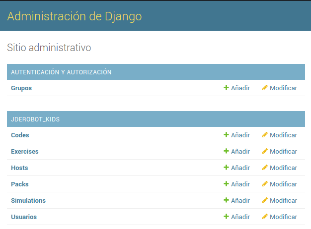
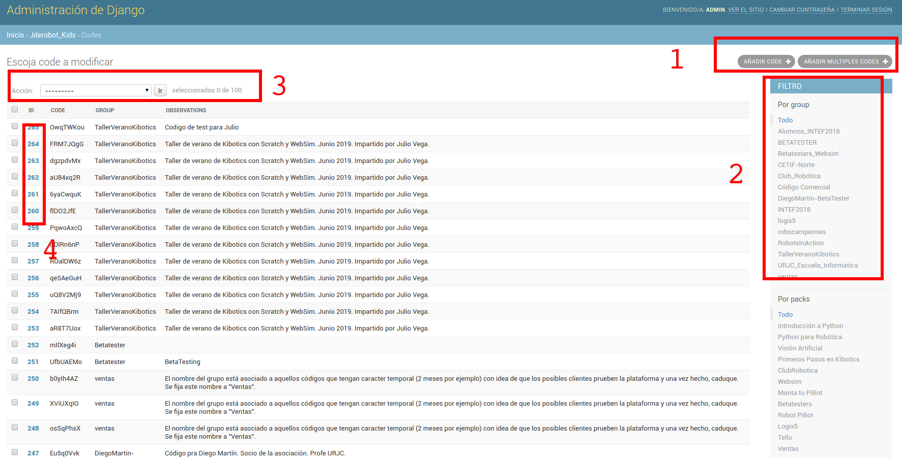
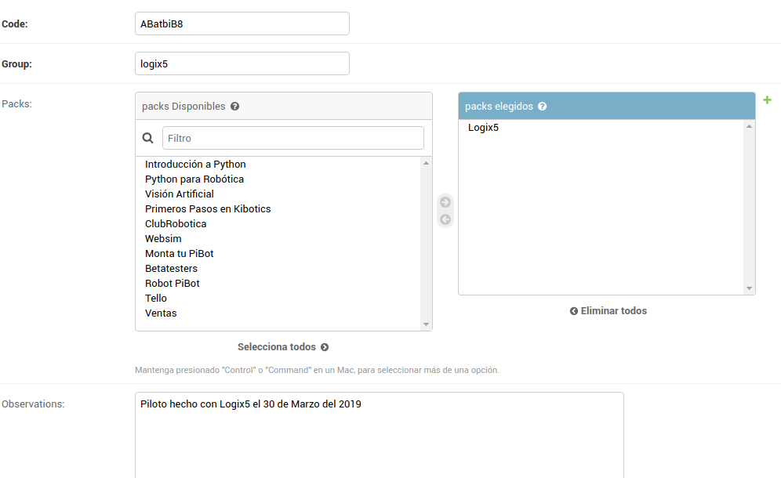
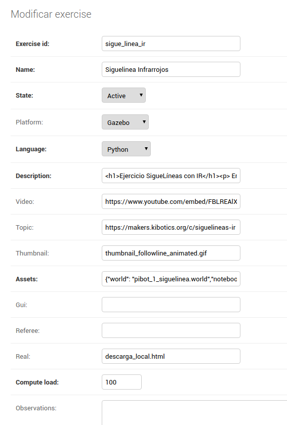
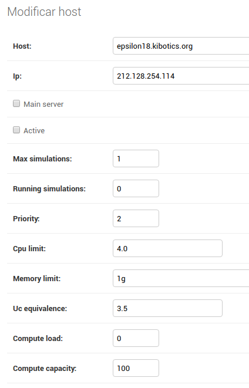
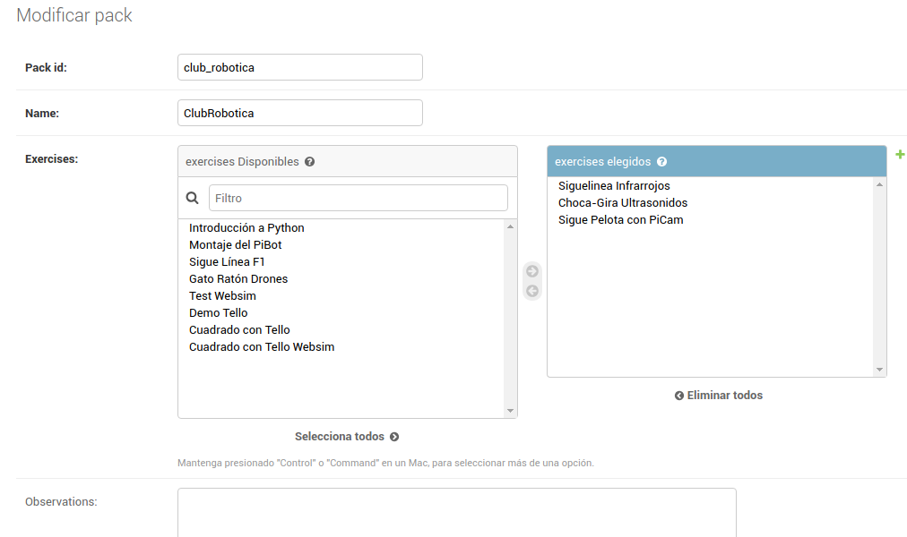

# Guía sobre el panel admin

Está dividido en las siguientes secciones:

- Codes
- Exercises
- Hosts
- Packs
- Simulations
- Usuarios

## Codes

Los códigos representan de cara al usuario **acceso a los ejercicios**.

1. **Añadir códigos a la tabla**: Puede añadirse o bien de uno en uno o utilizar el botón derecho que lo puede hacer en grupo. El derecho ha sido creado para que, una vez metidos, se realicen todos los pasos de asignación. Además, este segundo botón descarga un `.csv` con los códigos introducidos.
2. **Filtros**: Los filtros muestran una lista de los distintos códigos. Pulsar en uno, devuelve la petición a la base de datos que cumpla con la condición del filtro. Útil para buscar.
3. **Panel de acción**: Con este selector se pueden borrar entradas (códigos) de esta tabla, habiendo seleccionado anteriormente un ID con el *check*.
4. **Seleccionar una entrada**: Pulsando en un ID tenemos acceso a la entrada con sus características que se pueden modificar. En el ejemplo de los códigos sería como la imagen que se ve a continuación.

En la sección "packs elegidos" puede verse los packs que se asignaron en la creación del código. Puede añadirse o quitarse en función de la necesidad.

## Exercises

Sección destinada a los ejercicios donde se describen las condiciones, parámetros, enlaces, plantillas que llevará el ejercicio y que se cargarán cuando se ejecute.

## Hosts

Se definen los parámetros de la máquina de la granja, URL, IP, número máximo de simulaciones que permite, que están en ejecución, la prioridad de la máquina, el límite de núcleos y RAM de la máquina y la carga computacional máxima que admite de cada ejercicios. De esta manera, ejecicios con mucha carga, solo ejecutarán 1 o 2 contenedores docker en la máquina de la granja mientras que ejercicios con poca carga puede tener más instancias.

## Packs

Representan grupos de ejercicios que pueden asignarse a los códigos y, por tanto, a los usuarios. En  el ejemplo de la imagen puede verse que para el pack del "club_robotica" están asignados 3 ejercicios.

## Simulations

Esta tabla, si no hay actividad en la plataforma aparecerá vacía dado que es donde se registran las simulaciones y conexiones WebSocket que se registran. Está vinculado con máquina donde se esté ejecutando el ejercicio (para el caso de ejercicios en Python).

## Usuarios

Se tiene la lista de usuarios registrados en la plataforma así como los filtros previamente explicados.